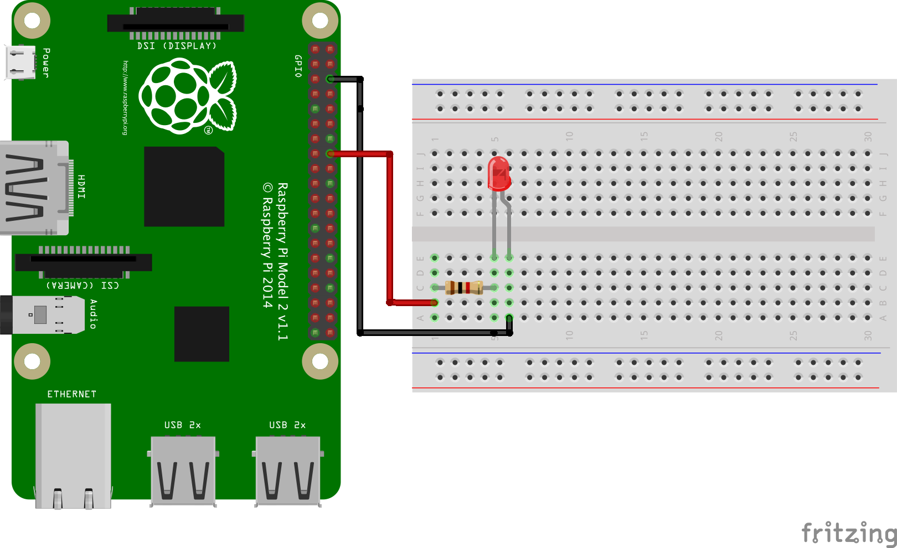

# l-tika-10-languages

## RPi 環境

```
$ lsb_release -a
No LSB modules are available.
Distributor ID:	Raspbian
Description:	Raspbian GNU/Linux 10 (buster)
Release:	10
Codename:	buster
```

## 配線図



## Python

Raspberry Pi OS に最初っから入っています。

```
$ python3 --version
Python 3.7.3

$ cd python/
$ python3 main.py
```

## Node.js

```
$ curl -sL https://deb.nodesource.com/setup_14.x | sudo -E bash -
$ sudo apt-get install -y nodejs

$ node --version
v14.6.0

$ npm --version
6.14.6

$ cd nodejs/
$ npm install
$ node main.js
```

## C言語

Raspberry Pi OS に最初っから入っています。

```
$ gcc --version
gcc (Raspbian 8.3.0-6+rpi1) 8.3.0
Copyright (C) 2018 Free Software Foundation, Inc.
This is free software; see the source for copying conditions.  There is NO
warranty; not even for MERCHANTABILITY or FITNESS FOR A PARTICULAR PURPOSE.

$ cd c/
$ gcc -Wall -o main main.c -lwiringPi
$ ./main
```

## Shell Script

Raspberry Pi OS に最初っから入っています。

```
$ bash --version
GNU bash, バージョン 5.0.3(1)-release (arm-unknown-linux-gnueabihf)
Copyright (C) 2019 Free Software Foundation, Inc.
ライセンス GPLv3+: GNU GPL バージョン 3 またはそれ以降 <http://gnu.org/licenses/gpl.html>

This is free software; you are free to change and redistribute it.
There is NO WARRANTY, to the extent permitted by law.

$ cd sh/
$ ./main.sh
```

## Rust

```
$ curl --proto '=https' --tlsv1.2 -sSf https://sh.rustup.rs | sh

$ source ~/.profile

$ cargo --version
cargo 1.45.0 (744bd1fbb 2020-06-15)

$ cd rust/ltika/
$ cargo run
```

## Golang

```
$ wget https://golang.org/dl/go1.14.6.linux-armv6l.tar.gz
$ sudo tar -C /usr/local -xzf go1.14.6.linux-armv6l.tar.gz

$ echo export 'PATH=$PATH:/usr/local/go/bin'  >> ~/.profile
$ source ~/.profile

$ go version
go version go1.14.6 linux/arm

$ cd golang/
$ go build main.go 
$ ./main
```

## Java

```
$ sudo apt install default-jdk

$ java --version
openjdk 11.0.7 2020-04-14
OpenJDK Runtime Environment (build 11.0.7+10-post-Raspbian-3deb10u1)
OpenJDK Server VM (build 11.0.7+10-post-Raspbian-3deb10u1, mixed mode)

$ curl -sSL https://pi4j.com/install | sudo bash

$ cd java/
$ javac -classpath .:classes:/opt/pi4j/lib/'*' -d . Ltika.java
$ java -classpath .:classes:/opt/pi4j/lib/'*' Ltika
```

## PHP

```
$ sudo apt-get install php

$ php --version
PHP 7.3.19-1~deb10u1 (cli) (built: Jul  5 2020 06:46:45) ( NTS )
Copyright (c) 1997-2018 The PHP Group
Zend Engine v3.3.19, Copyright (c) 1998-2018 Zend Technologies
    with Zend OPcache v7.3.19-1~deb10u1, Copyright (c) 1999-2018, by Zend Technologies

$ curl -sS https://getcomposer.org/installer | php
$ sudo mv composer.phar /usr/local/bin/composer

$ composer --version
Composer version 1.10.9 2020-07-16 12:57:00

$ cd php/
$ composer install
$ sudo php main.php
```

## Ruby

```
$ sudo apt-get install ruby

$ ruby --version
ruby 2.5.5p157 (2019-03-15 revision 67260) [arm-linux-gnueabihf]

$ sudo apt-get install ruby2.5-dev libssl-dev
$ sudo gem install bundler

$ gem --version
2.7.6.2

$ bundler -v
Bundler version 2.1.4

$ cd ruby/
$ bundle install
$ sudo ruby main.rb
```

## Perl

```
$ perl --version

This is perl 5, version 28, subversion 1 (v5.28.1) built for arm-linux-gnueabihf-thread-multi-64int
(with 61 registered patches, see perl -V for more detail)

Copyright 1987-2018, Larry Wall

Perl may be copied only under the terms of either the Artistic License or the
GNU General Public License, which may be found in the Perl 5 source kit.

Complete documentation for Perl, including FAQ lists, should be found on
this system using "man perl" or "perldoc perl".  If you have access to the
Internet, point your browser at http://www.perl.org/, the Perl Home Page.

$ cpan --version
Loading internal logger. Log::Log4perl recommended for better logging
/usr/bin/cpan version 1.64 calling Getopt::Std::getopts (version 1.12 [paranoid]),
running under Perl version 5.28.1.
  [Now continuing due to backward compatibility and excessive paranoia.
   See 'perldoc Getopt::Std' about $Getopt::Std::STANDARD_HELP_VERSION.]
Nothing to install!

$ cpan
cpan[1]> install RPi::WiringPi
cpan[2]> install RPi::Const
cpan[3]> exit

$ cd perl/
$ perl main.pl 
```
